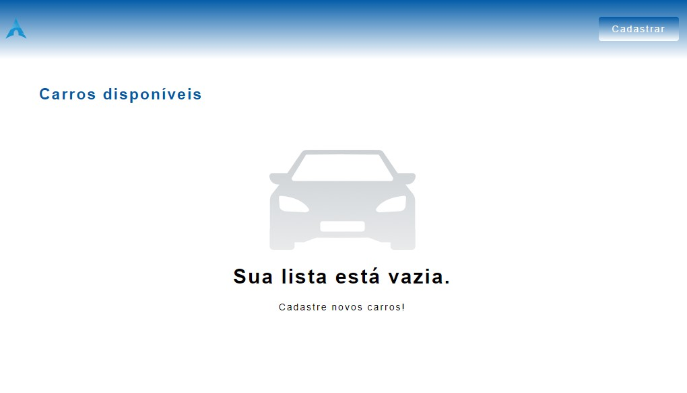
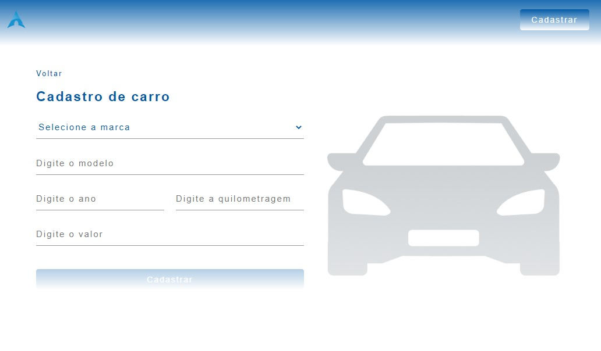
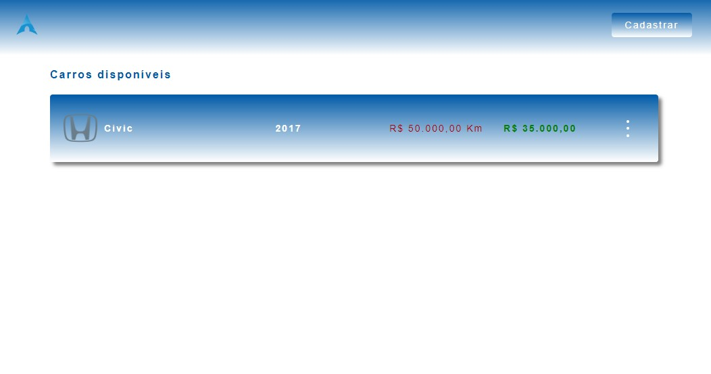

# Test Registration !  🚘 🚞
 

## Cadastrar carros de vários modelos. 🚀 💻 📚

### [Test Registration](https://react-js-test-registration.netlify.app/) 🔗

## Tecnologias que utilizei para o projeto ;  

 
    
    
    
    

 

##  As funcionalidades:
- Cadastrar carros ;
- Edita infomacões ;
- Excluir infomacões ;
## O código foi desenvolvido usando os conceitos ; 
- Hooks ; useState, useEffect, useReducer e useContext ;
- API local ;
- As rotas foram criadas com React Router Dom 6.
- Testes Unitários;
- Testes Integração;
- Resposividade
- Clean Code
## A estilização ; 
- Styled Components; 
## Dependencias ; 
- Uuid ; 
- Jest ; 
- Testing Library ; 
- React Router Dom dentre outros. 
## 🎲 Rodando o Back End (servidor)
- npm install
- npm startoperation. Once you 
